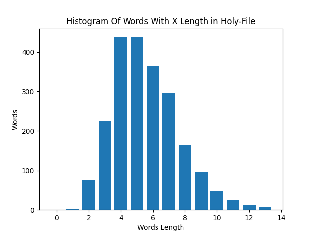
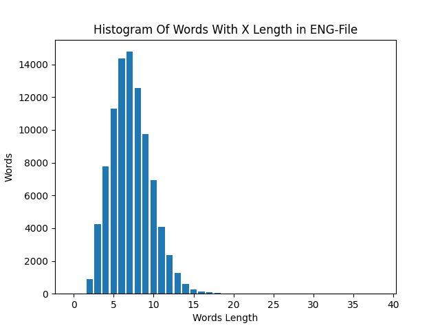
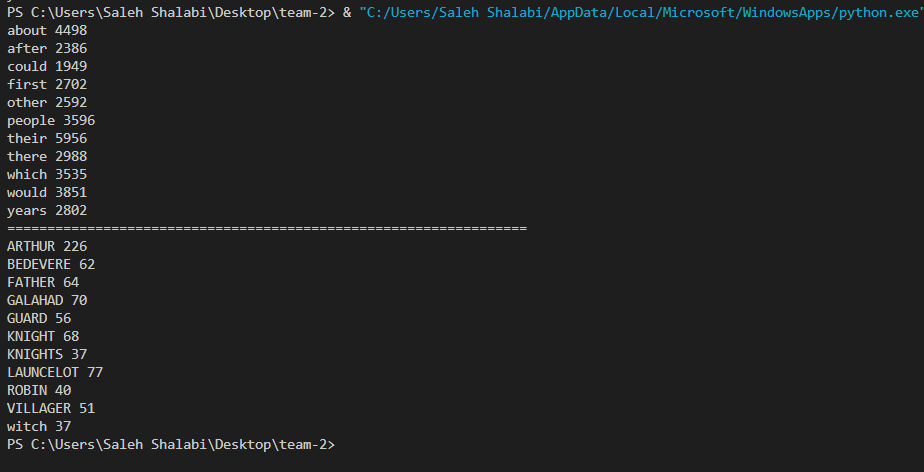
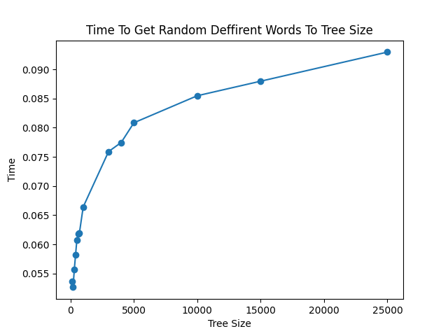
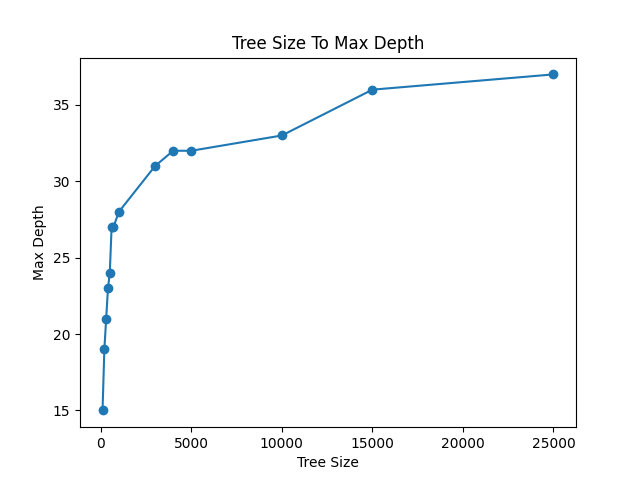
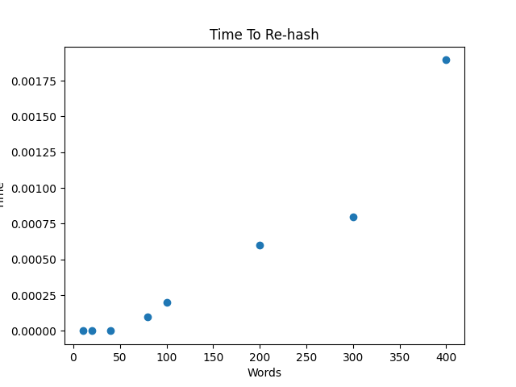
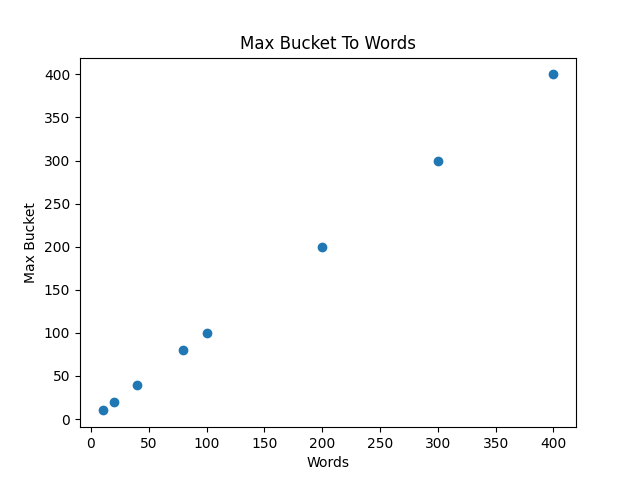

# Mini-projekt rapport 
Medlemmar:  Saleh Shalabi 
Program: Mjukvaruteknik   
Kurs: 1DV501   
Inlämningsdatum: 2020-10-30

## Introduktion 

I detta projekt arbetas det med stora mängder av data. Hur kan det subtraheras till mindre och enklare data, hur detta kan struktureras och analyseras med hashing set och Binära sök trädet, och även jämföra de två sätten, effektivitet och tillämpningar.

Datan som arbetas med är strings, alltså ord som ska subtraheras från stora textfiler för att sedan kunna arbeta med det vidare.

När datan har strukturerat kan vi då använda strukturerna för att till exempel beräkna antalet unika ord samt totala antalet ord i filerna. Äaven att beräkna de mest 10 förekommande orden i texterna eller antalet ord av samma längd.

Outputen av detta projekt presenteras i grafer av olika slag som förenklar att se resultaten.

## Part 1: Dividera text till ord

- Orden valdes att definieras i en komplicerade sätt.

    - Ett ord kan endast innehålla bokstäver från (``A``) till (``Z``) och (``a``) till (``z``) eftersom detta var engelska filer vi arbetade med. Alltså ett ord kan inte innehålla nummer eller tecken. undan tag var tecknet (``'``) eller som det kallas (apostrof). Detta undantag gjordes eftersom engelskan kan innehålla förkortningar som (``I'm``) eller (``Can't``).
    - Inga ord består av en bokstav förutom (``A``), (``a``) och (``I``).
    - Ett ord kan inte bestå av samma bokstav. Till exempel orden ``AAAA`` , ``AAaaAAaa`` eller ``mmmm``  räknas inte som ord och därför tas dem bort. Men ord som ``AAAAH`` , ``HAHAHAHA`` eller ``hahaha`` eftersom dem inte består av samma bokstav tas dem i inräkningen.
    - Ett ord kan inte bestå av stora och små bokstäver om inte just första bokstaven är stor och resten är litet. ord kan dock bestå av stora bokstäver eller små. undantag blir namn som ``iPhone`` , ``MacBook`` eller ``NewYork``. samt namn som börjar med ``Mc`` som i ``McDonalds``.
    - En mening som ``MyNameIsSaleh`` räknas inte som ord utan separeras och blir ``My Name Is Saleh`` och tas med ord för ord. 
    - Ett ord kan inte innehålla (``'``) apostrof i början eller slutet och därför tas apostrofen bort och ordet läggs till. Exempel (``''word'''``) blir till (``word``). Ett ord får dock innehålla en apostrof som i ``Word's`` eller ``John's``. Därmed även i ord som består av stora bokstäver som i ``TV's``.

- För att kunna implementera detta och få det att funka användes flera funktioner som finns i filen [cleaning_words](./mini_project/cleaning_words.py). 

    - Första funktionen ``from_file(path)`` öppnar och läser en fil. av filen läses alla bokstäver och tecken som är godkända enligt definitionen addera allting to string med ett mellan slag där något tecken som inte är med i definitionen och sedan splittas den stringen och retuneras som lista.
    - Andra funktionen ``word_(lst)`` tar listan från ``from_file(path)`` och ittererar igenom ord för ord. på ordet testas resten av funktionerna som är ``spl(wprd)`` , ``same(word)`` , ``blandat(word)`` och ``apos(word)``som testar kraven på ordet och ifall de kraven inte uppfylls blir det åtgärder som att splitta menningar med ord som sitter ihop eller ta bort apostrofer.
    - exempel på detta är funktionen:

        ```python
        def apos(word):
            "Funktion som ska ta bort alla apostrofer från början eller slutet av ett ord"

            while  word.endswith("'") or word.endswith(" "):                                                     # så länge ordet slutar med apostrof
                word = word[0:len(word)-1]                                                                        # ordet blir den samma minus det sista tecknet
                                                    
            while word.startswith("'") or word.startswith(" "):                               # så länge ordet börjar med apostrof
                word = word[1:]                                                                     # ordet är den samma minus det första tecknet
            return word                                                   
        ```

- Resultatet av att köra detta på filerna [eng_news_100K-sentences.txt](./mini_project/eng_news_100K-sentences.txt) blev till totalt antal ord av ``1963867`` och totalt antal ord av [holy_grail.txt](./mini_project/holy_grail.txt) blev till ``11287``.

- Resultaten av att köra programmet i filerna sparas i nya filer med ett ord i varje rad för effektivtetens skull i senare behandling.

# Part 2: Implementera data strukturer

- För att kunna implemntera datan på rätt sätt gavs 2 demo program [word_set](./mini_project/word_set.py) och [table](./mini_project/table.py) som innehöll oskrivna funktioner. När funktionerna skulle bli färdiga skulle resultaten av de 2 programen vara den samma som i filerna [word_set_main](./mini_project/word_set_main.py) och [table_main](./mini_project/table_main.py). Dessa funktioner skulle göra det möjligt att implementera all data som fås ut i part 1. 

## Hashing

- I funktionen ``add(word_set, word)`` kollas först och främst om ordet finns redan i setet. detta genom att anropa funktionen ``contains(word)``. när ordet inte finns i setet kollas antal buckets som finns med funktionen ``bucket_list_size(word_set)`` och jämförs med antal element i setet med funktionen ``count(word_set)``. när antal element är mindre än antalet buckets då ska ordet få en hashing värde för att kunna läggas till i sin plats annars måste antalet bucket fördubblas och rehashingen på alla element sker sedan läggs ordet till i sin nya hashings värde plats.
    - Hashing sker med funktionen ``hasing(word)`` som i sin tur gör först alla bokstäver i ordet till små bokstäver för att lägga samma ord som består av stora eller små bokstäver i samma plats. ascii värdet av varje bokstav tas som string. Alltså ett ord som ``AB`` får ett string värde av  ``9293``.
    - Sedan tas ascii värdet av varje bokstav och aderas som intigers. Ett ord som ``AB`` blir till ``92 + 93 = 185``. När detta värde har fåtts delas det med ``2``.
    - Sedan tas string värdet och omvandlas till intiger och då tas modulus det värdet genom intigers värdet. 
        Detta sker för att så mycket som möjligt försöka få att varje ord ska få en unik plats i setet. Funktionen ser ut som följande:
    ```python
    def hashing(word):
        "Hashing funktionen"

        word = word.lower()                                                    # gör ordet till lower case detta gör att ord som Word och WORD och word får samma bucket
        x = ""                                                             
        y = 0
        for c in word:                                                          # addera ascii värdet som str säg vi har AB som ord dett får värdet 9293 alltså de adderas inte
            x += str(ord(c))
        for c in word:                                                                  # addera ascci värden till varandra som AB får värdet 93 + 92 = 185 sedan dela värdet med två
            y += (ord(c)) 
        y = round(y/2)
        return int(x) % (y)    
    ```
        
    - Rehashingen funkar genom att alla ord som redan finns i setet kopieras till en ny lista. Sedan tas antalet buckets i listan och fördubblas, sedan toms setet.
    Antalet delas med 10, detta är för att sedan adderas det nya bucket med funktionen ``new_empty_set()`` som ger 10 bucket varje gång den körs.
    Alltså en loop genom range fördubblade buckets delat till 10 adderas new_empty_root(). exempel på detta är 80 när det fördubblas blir det 160 och genom 10 blir det 16. En loop på 16 gånger ger 10 buckets varje gång. Talet kommer att alltid vara jämn delbar med 10 eftersom det börjar med 10 buckets och fördublas hela tiden.
    - När detta är klart körs ``add`` funktionen i rehashing funktionen igen med listan som innehåller alla element som fanns i setet innan fördublingen.
    - Till slut returneras den rehashade listan.

- Resultatet som fås är densamma som i [word_set_main](./mini_project/word_set_main.py) förutom i funktionen ``to_string()`` en annan ordning fås ut. Detta är eftersom i funktionen tas alla ord i ordningen de kommer och printas ut. Denna annorlunda ordningen på outputen är på grund av att hashing metoden är annorlunda och ger ett annat värde som blir plats till ordet.
- Resultatet av funktionen ``max_bucket_size`` fås till ``669`` på filen ``eng_news_100K-sentences.txt`` och ``25`` på file ``holy_grail.txt``.

## BST

- For the BST based table, present (and explain in words):
    - Funktionen ``add(root,key,value)`` matas in med en root som isin tur består av en lista av 4 element som är None. Key som är ordet som vi vill placera i trädet (rooten) och value som kan vara då ett tal för ordet. Funktionen börjar att kolla om första platsen i root är None. ifall det är läggs ordet i första platsen och value i andra, där med förblir tredje och fjarde platsen med None.
    - Ifall att första platsen inte är None, jämförs det befintliga ordet i första platsen med ordet som ska läggas till. Ifall ordet som ska läggas till har ett större värde än ordet i första platsen går programmet till 3je platsen och checkar ifall den är None. Om det visar sig vara None, byts None till en ny root, Alltdå en lista med 4 platser, vardera är None, och ordet får läggas i Första platsen med value i andra pltasen genom att använda funktionen recursivt. Om trdje platsen inte var None, körs funktionen ``add`` recursivt med 3je platsen som root istället än första rooten som var.
    - När ordet som ska läggas till har ett större värde än ordet som finns i första platsen körs det på samma sätt som när det har mindre värde men med 4de platsen istället än 3je.
    - Om vid något tillfälle hittas samma ord, uppdateras value till nya value.
    - Till slut retuneras root.
    - Funktionen set ut enligt följande:
    ```python
        def add(root,key,value):
            node = root 
            if node[0] == None:                             # om första platsen i noden är none adderas key till den och value till andra platsen
                node[0] = key               
                node[1] = value
            elif  node[0] == key:                               # om ordet finns redan uppdateras value endast
                node[1] = value
            else:
                if node[0] > key:                               # om nya ordet är mindre kollas 3de platsen 
                    if node[2] == None:                         # om den är none adderas en ny root där och key och value läggs i första och andra platsen
                        node[2] = new_empty_root()
                        add(node[2],key,value)
                    else: add(node[2],key,value)                  # om det inte är none körs det recursivt som denna platsen som root
                elif node[0] < key:                                 # om key är större checkas 4de platsen
                    if node[3] == None:                             # om den är none adderas en ny root. key och value får ha första och andra platsen i den
                        node[3] = new_empty_root()
                        add(node[3],key,value)
                    else: add(node[3],key,value)                    # om den inte är none körs det rucursivt med 4de platsen som root
            
            return root  
    ```   
 
- Funktionen ``max_depth`` matas in med den root som sin längsta gen ska mätas. 
- När funktionen körs skapas det 2 värde med ett vardera, en left och en right.
- Funkktionen kollar då att först rooten inta ska ha värdet av None eftersom detta betyder att det är slutet av trädet. sedan körs kollas om 3de platsen inte är None, alltså tom och då adderas left till värdet som av att köra funktionen recursivt med 3de platsen som root. alltså addera 1 till left varje gång den går et steg till vänster.
- Funktionen kollar sen 4de platsen oc hpå samma sätt som med 3de platsen körs funktionen recursivt och adderar 1 till Right varje gång. 
- Slutligen jämfors Left och Right och det större värdet returneras. När dessa variabler har samma värde, returneras en av dem.
    ```python
    def max_depth(node):
        left, right = 1, 1                              # variabler till höger och vänster längdet
        if node != None:                                    # om node inte är 0 då är vi inte på slutet
            if node[2] != None:                                     # om 3de platsen inte är none då går den in recursivt där och adderar en varje gång
                left += max_depth(node[2])
            if node[3] != None:                                         # om 4de platsen inte är none då går den in recursivt och adderar till höger värdet
                right += max_depth(node[3])    
                                            # jämförelse mellan höger och vänster längder för att retunera det större
        if left > right:
            return left
        elif right > left:
            return right
        else:                                   # om dem är samma retuneras en av dom  
            return left
    ```

    - Resultatet som fås av att köra dessa funktioner i ``table_main`` är exakt den samma som de angivna resultaten.
    - ``Max_depth`` Funktionen ger ett resultat på ``43`` när den körs med filen ``news_100k`` och ett värde av ``26`` när den körs med texten``holy_grail``

# Part 3: Ord relaterade övningar

## Antal unika ord i varje text
- Att beräkna antalet unika ord enligt i varje text av de 2 tidigare nämnda filerna med hjälp av setet som skapdes. 
- Att lösa uppgiften gick ut på att köra båda funktionen ``add`` i ``word_set`` med de orden som fås av att köra filen [cleaning_words](./mini_project/cleaning_words.py). 
Sedan använda funktionen ``count`` i ``word_set`` för att få resultatet av antalet unika ord som nu finns i setet. För att säker ställa att Resultatet är rätt körs Python set på samma ord filer och resultatet visar sig vara densamma.
- Resultatet av antal unika ord i filen ``english_news`` blev ``91470`` unika ord och av filen ``goly_grail`` blev det ``2198`` unika ord.

## Att beräkna antalet ord av samma längd
- Uppgiften är att presentera med hjälp av ``matplot`` en histogram som visar antalet av orden som har samma längd. 
- För att lösa uppgiften byggs träde med alla ord av filerna. 
- Sedan används funktionen ``get_all_pairs`` i ``table`` för att få alla ord som finns i trädet. 
- för att kunna få så bra axslar som möjligt till histogrammet krävs det att hitta det längsta ordet. Detta för att inte dra ut på axlarna mer än nödvändigt och få så snygg graf som möjligt. Detta görs genom att itterera genom alla ord som finns i ``get_all_pairs`` och få det längsta av dem.
- När det längsta ordet fås. skapas en lista som ska ha så många listor i som ord längder. Alltså är lämgsta ordet ``25`` bokstav lång så adderas det 25 listor i den listan.
- Sedan genom att itterara genom ``get_all_pairs`` igen läggs alla ord av samma längd i sina plattser. Alltså ett ord av längden ``3`` får gå till tredje platsen i den listan som i sin tur är en lista och läggas där.
när detta har skett, fås axlarna. X-axeln är längden på orden och Y-axeln är antalet ord av samma längd. och då kan resultatet plottas ut.
- Resultatet av att köra detta på filerna visade sig följa en ungefär jämn fördelning enligt histogramen nedan.



## Att hitta de 10 mest förekommande ord i texterna 

- Uppgiften är att hitta de 10 mest förekommande orden i varje text som har en längd mer än 4 bokstäver.
- För att lösa uppgiften användes funktionen ``get_all_pairs`` för att få alla alla ord från trädet igen.
- genom att itterara gemom det tas antalet av hur många ett ord förekommer. 
- listan sorteras och reversas. Alltså dem 10 största värden hamnar i början. 
- genom att itterera genom den listan 10 gånger och samtidigt genom all pairs jämförs värden. Då orden som har samma värde och värdet printas ut.
- Resultatet som fås visas i bilden nedan. ``english_news`` är det gögre medans ``holy_grail`` är den nedre.



# Part 4: Tids beräkning

## Att mäta tiden att hitta ord i ett träd samt att få max depth av träd i olika storlekar

Uppgiften är att bygga flera träd av olika storlekar. I dessa träd ska det sökas efter ett givet antal olika träd och mäta tid det tar att hitta det. Sedan presentera i ett diagram med hjälp av matplot hur det skiljer sig att hitta orden beroende på trädet storlek. I uppgiften ingår det att presentera ``max_depth`` av trädet och hur den skiljer sig beroende på trädets storlek.

- För att lösa uppgiften skrivs det två funktioner ``tree_making`` som bygger upp ett träd av en storlek som anges, 
```python
    
def tree_making(lst,b):
    "function som bygger upp träd av en lista med ord och hur stort trädet ska bli"

    x = 0
    tree = tbl.new_empty_root()
    for c in lst:
        if x != b:
            tbl.add(tree,c,1)
            x+=1
        else: break
    return tree                       
```

och  ``time_cou`` som då mäter tiden att hitta ett x antal random ord i detta trädet som anges. Oprationen som mäter tiden görs 10 gågnger, detta är för att få en så rätt resultat som möjligt.
```python
def time_cou(lst):
	"funktion som räknar tiden det tar att hitta 20000 random ord av en lista i teädet den matas med"
	tot = 0
	global word_lst_eng
	t0 = time()
	repet = 0                                       # reptera 10 gånger för att få så nära sanningen som möjligt
	while repet != 10:
		for c in range(20000):
			x = randint(0,91469)
			tbl.get(lst,word_lst_eng[x])
		repet += 1
	t1 = time()
	tot += (t1-t0)   
	return tot/10         
```

- Genom att bygga upp träd av olika storlek och addera dess storlekar till en lista fås X axeln.
Sedan körs dessa träd i funktionen ``time_cou`` och resultatet adderas i en annan lista som då blir Y axeln. Resultat sedan plottas ut med matplot.
- Förväntat resultat var att ju mindre trädet desto mindre chans skulle det finnas att hitta orden och då skulle programet behöva gå hela vägen på trädet för att sedan avslutas, även fast den vet vilken väg den ska följa. Men ju större trädet blir ju större chans är det att hitta ordet, alltså det behövs inte sökas enda ut i trädet, dessutom så vet programmet vilken väg den ska följa. alltså förväntat resultat var att det ska vara en kurva som gå upp ganska prant i början som sedan börjar jämna ut sig.

- Resultatet som fåtts ur exprimentet var som den förväntade resultatet. det visas nedan i grafen.


- I mätningen av ``Max_depth`` användes samma X axeln men skillanden på Y axeln var att funktionen ``Max_depth`` i ``Table användes`` på samma träden som byggdes förr. resultatet av funktionen adderas till en ny lista sedan plottas grafen ut med trädens storlek som X axeln och ``max_depth`` som Y axeln.

- Förväntat resultat var att ju mindre trädet är ju mer det skulle påverkas av att lägga till ett nytt ord. Alltså när ett träd är litet då skillnaden på grenarna skulle påverkas mer av att lägga till ett ord, men när teädet blir större och större skulle det inte påverkas lika mycket av att lägga till ett ord. På så sätt skulle ``Max_depth`` av träden öka ganska brant i början och sedan börja jämnas ut.
- Resultat som fåtts var samma som förväntat. detta visas i grafen nedan. 


## Att mäta tiden det tar att hasha en given antal ord samt att jämföra max bucket size ju fler ord det finns i setet

- uppgiften var att bygga upp set med olika antal ord och mäta tiden den tar att hasha dessa ord och sedan presentera resultatet i en digaram med hjälp av matplot. sedan var det att räkna ``max_bucket_size`` av dessa set och presentera set storleken till max bucket. 

- För att lösa uppgiften följdes samma metod som uppgiften före med att skriva två fubktioner ``bucket_size`` som ger antalet element i den bucket som innehåller mest element
```python
	def bucket_size(x):
    	"en funktion som retunerar antalet element i en hash set av angiven ord mängd"

        global word_lst_eng
        count = 0
        word_set = ws.new_empty_set()
        for c in word_lst_eng:
            if count != x:
                ws.add(word_set,c)
                count += 1
            else: break
        return ws.max_bucket_size(word_set)
```

Samt en till funktiojn som mäter tiden av att lägga till en given antal olika ord ``adding_words_time``
```python
    def adding_words_time(x):
        "Funktion som mäter tiden av att hasha och rehasha så många ord som det anges"

        global word_lst_eng                 # listan med ord
        tot = 0
        count = 0                            
        word_set = ws.new_empty_set()
        r = 0                               
        t0 = time() 
        while r != 10:
            for c in word_lst_eng:
                if count != x:
                    ws.add(word_set,c)
                    count += 1
                else: break
            r+=1
        t1 = time()
        tot += (t1-t0)
        return tot/10                                                      # retunerar tiden den tog
```

- Resultaten av varje funktion läggs till en en egen lista som ska föreställa Y axeln i varje digaram där X axeln kommer vara antalet ord i setet.

- Förväntat resultat av tiden att hasha ord tänktes vara längre ju fler ord det finns att hasha. detta är på grund av att rehashingen som tar den mesta tiden skulle ske mer och mer gånger ju fler ord det finns eftersom vi har för litet antal ord från början jämfört med antalet ord. Alltså resultatet skulle bli en kurva som ökar exponetielt ju flera ord det finns att lägga till hash setet.
- Förväntat resulat för max bucket var att max bucket skulle öka på ett konstant sätt eftersom ju färre ord det finns ju mer chansen är att varje ord hamnar i en unik plats och tvärtom.

- Resultaten visade sig vara som förväntat och det presenteras i diagramen nedan.

 

# Projektets slutsatser

- Detta projekt var mycket lärorikt. Framför allt i att arbeta med data, hur det kan förnkelas och hur det kan struktureras. 
- Under projektet stöts det på många problem som man tidigare inte jobbat med. Detta i sig är mycket kul och framför allt lärorikt att kunna jobba med sådana problemlösningar. 
- Att använda matplot för att presentera resultaten var mycket bra eftersom man blir lite bekant med detta fantastiska verktyg om man skulle nu arbeta med datt analys i framtiden.
- Att ha en deadline som man ska följa och känna sig stressad efter att bli klar med innan den kommer var bra då man lär sig att hantera stressen och vara produktiv under omständigheter som inte är så bekväma. Samtidigt så får man en inblick på framtidens uppgifter och att det kan bli stressigt och att man måste bli klar med sina uppgifter under tiden man får.

# Tekniska problem 

- Den mesta tiden spanderas på att förstå BST och hashing eftersom man inte kan lösa uppgifterna om man inte har fullt förståelse till detta. 
- Då att bygga upp dessa metoder och deras funktioner var det som tog mest tid under arbetet. 
- Ett problem stod då man skulle använda matplot som visade sig vara på grund av python installationen. Detta löste sig genom att ladda ner en full Python variation från Python hemsida. 
- Att arbeta i en grupp med medlemmar av olika erfarenheter och inte hålla en bra kommunikation var av de mest framträdande svårigheterna under arbetet. Detta gjorde att den mesta delen hamnar på den kunniga i gruppen medan andra medlemmar inte känner sig lika delaktiga i arbetet. Å andra sidan var det en tid oc hdeadline att passa, vilket krävde att arbetet skall gå framåt. På så sätt blev det automatiskt att den större delen av arbetet hamnar på en.
- I gruppen fördelas arbetet, och varje medlem har ansvar att se till att sin part blir klar för att kunna gå vidare med alla uppgifter. Om inte varje medlem tar det ansvaret blir det svårt att förtsätta ha en god sammarbete i gruppen.  
- Med mer tid att lösa uppgiften skulle resultaten som presenterades tidigare inte skilja sig särskilt mycket men där emot skulle man kunna ha mer tid att se över sin "code" och kunna optimera den mera.

# Projekts problem

- Eftersom vi var endast 2 melemmar i gruppen var det automatiskt att det blev tyngre arbete som hamnar på varje i gruppen.
- Kommunikation i gruppen börjades lite sent på grund att gruppen jobbade lite indelat på distans och på plats. Sedan att informationen gick fram ganska sent efter projektets gång på grund av distanshållningen.
- För Saleh Shalbi kvittade det vilken del som delas till att jobba med, oh där med fick Daniel Karlsson välja att arbeta med del ett.
- Saleh fick part 2 att arbeta med. Någon vecka senare när part 2 var klar gjord och redo för att testas försökte gruppen att ses och lyckades till slut. Men när gruppen har väl träffats hade del ett inte varit klar att kunna köra de stora filerna med. Gruppen hjälptes åt en stund men eftersom den ena ville hinna med sitt pendelfordon avbröts aebetet där. När nästa träff i gruppen skedde var fortfarande del ett inte klar än. och på samma sätt skulle den ena i gruppen hinna med sin pendelresa. Detta ledde till att Andra grupps medlemen kände sig kvar lämnad ensam för att arbeta med projektet själv. Detta i sin tur ledde till att medlemen arbetade även med part ett från början och löste det till nästa träff med gruppen.
- När den ena har redan lyckats med part 1 och 2 kändes det som att andra medlemmen gav upp att kunna bidra till arbetet. Detta resulterade att den ena i gruppen gjorde allting. Även om den andra ville hjälpa med till exempel raport skrivningen så kunde den inte bidra så mycket till på grund av bristande på förståelse av uppgifterna.
- Antal timmar lagt per vecka på projektet över steg 100 timmar per vecka föe den medlemmen som gjorde alllting i projektet. 
- Att börja i tid är nyckeln till att lyckas med projektet. Stressen i gruppen förminskas när det finns tid kvar till arbetetsinlämnning. Detta leder till att medlemmerna känner sig lika delaktiga och stressen påverkar inte medlemmerna negativt.  
- Ifall man hamnar mötande ett liknande projekt i framtiden ska man först se till att få en god kommunikation med sina grupps medlemmar. Sätta en tidsplanering som ska följas under projektet. Att så mycket som möjligt kunna hålla de träffen gruppen behöver för att slutföra uppgifterna.


